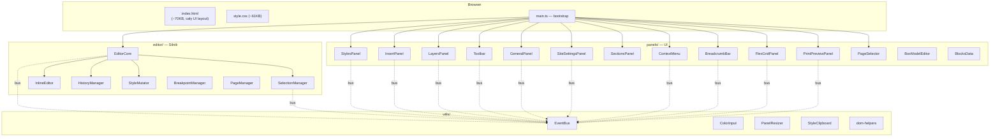
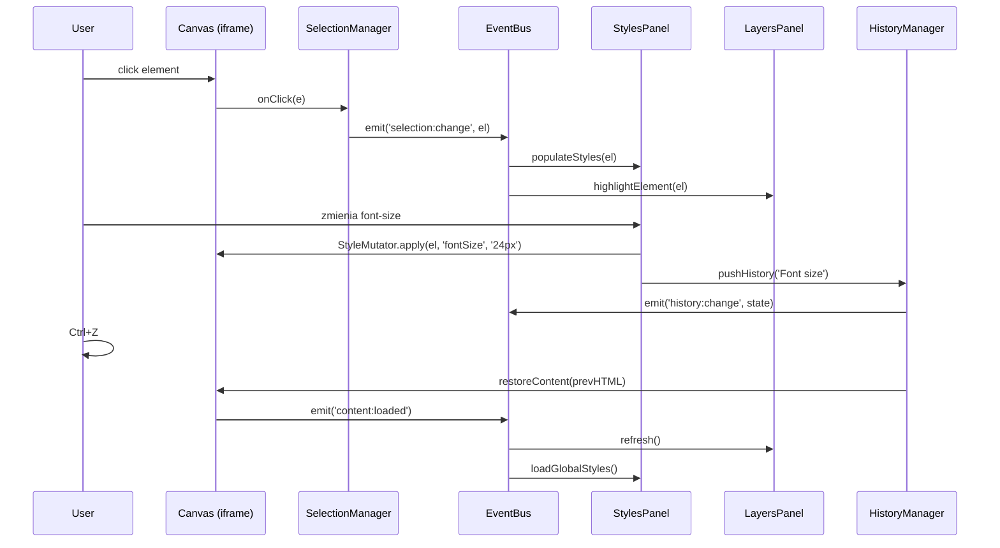

# SnapEdit — Dokumentacja Techniczna

**Repo:** `/root/.gemini/antigravity/scratch/snapedit`
**Live:** [https://snapedit.syhi.tech](https://snapedit.syhi.tech)
**Stack:** TypeScript + Vite 6 • Vanilla CSS • Zero runtime deps
**Branch:** `feature/round6-advanced-styles` (HEAD: `6edfe34`)

---

## Spis treści

1. [Architektura](#architektura)
2. [Mapa plików](#mapa-plików)
3. [Editor Core — Silnik](#editor-core--silnik)
4. [EventBus — System zdarzeń](#eventbus--system-zdarzeń)
5. [Panele UI](#panele-ui)
6. [Utilities](#utilities)
7. [Flow danych](#flow-danych)
8. [Komendy deweloperskie](#komendy-deweloperskie)
9. [Deployment](#deployment)
10. [Konwencje & FAQ](#konwencje--faq)
11. [Historia & Backlog](#historia--backlog)

---

## Architektura



### Kluczowe decyzje architektoniczne

| Decyzja | Dlaczego |
|---------|----------|
| **Iframe canvas** | Cała edytowana treść żyje wewnątrz `<iframe>` — izoluje style użytkownika od UI edytora |
| **EventBus (pub/sub)** | Luźne powiązanie modułów — panele i silnik komunikują się przez zdarzenia |
| **Zero runtime deps** | Czyste TypeScript + Vite. Jedyny runtime dep to `pagedjs` (print preview) i `turndown` (HTML→Markdown export) |
| **Historia: snapshoty** | `HistoryManager` przechowuje pełne `innerHTML` snapshoty (max 20) — prosty, niezawodny undo/redo |
| **Cały UI w `index.html`** | Layout edytora (toolbar, sidebary, panele) jest statyczny HTML, a TypeScript montuje na nim logikę |

---

## Mapa plików

```
snapedit/
├── index.html               # Cały layout UI (~70KB) — toolbary, sidebary, panele
├── src/
│   ├── main.ts               # Bootstrap — tworzy EditorCore + wszystkie panele (186 LoC)
│   ├── demo-content.ts       # Domyślny HTML demo (ładowany gdy brak treści)
│   ├── style.css             # Globalne style edytora (~61KB)
│   ├── editor/
│   │   ├── EditorCore.ts     # Główny kontroler: iframe, historia, drag-drop, eksport (686 LoC)
│   │   ├── SelectionManager.ts # Hover/click selection, overlays (175 LoC)
│   │   ├── InlineEditor.ts   # Dblclick → contenteditable text editing (89 LoC)
│   │   ├── HistoryManager.ts # Undo/Redo stack, 20 wpisów, debounced (133 LoC)
│   │   ├── StyleMutator.ts   # Aplikuje CSS na elementy + globalne style (99 LoC)
│   │   ├── BreakpointManager.ts # Desktop/Laptop/Tablet/Mobile toggle (107 LoC)
│   │   └── PageManager.ts    # Multi-page support (89 LoC)
│   ├── panels/
│   │   ├── StylesPanel.ts    # Prawy panel: typography, kolory, spacing, border, obrazy, SVG (979 LoC)
│   │   ├── GeneralPanel.ts   # Tab "Global": palety, typografia, ikony, przyciski, transitions, CSS (1228 LoC)
│   │   ├── InsertPanel.ts    # Tab "Insert": elementy, obrazy, embed, formularze, komponenty (427 LoC)
│   │   ├── Toolbar.ts        # Górny toolbar: undo/redo, load modal (3 taby), export HTML/MD (504 LoC)
│   │   ├── LayersPanel.ts    # Lewy sidebar: drzewo DOM, drag reorder, rename, auto-expand (481 LoC)
│   │   ├── SectionsPanel.ts  # Tab "Sections": gotowe bloki (hero, CTA, pricing...) (291 LoC)
│   │   ├── BlocksData.ts     # Dane bloków (HTML templates) dla SectionsPanel (697 LoC)
│   │   ├── SiteSettingsPanel.ts # SEO meta, favicon, language, header/footer generator (407 LoC)
│   │   ├── PrintPreviewPanel.ts # Podgląd wydruku (paged.js), resizable (331 LoC)
│   │   ├── FlexGridPanel.ts  # Kontrolki flex/grid layout (175 LoC)
│   │   ├── ContextMenu.ts    # PPM: duplicate, delete, move, wrap, save as component (237 LoC)
│   │   ├── BreadcrumbBar.ts  # Dolna ścieżka ancestor path (84 LoC)
│   │   ├── PageSelector.ts   # Dropdown multi-page selector (77 LoC)
│   │   └── BoxModelEditor.ts # Visual box model (margin/padding) (75 LoC)
│   ├── utils/
│   │   ├── EventBus.ts       # Pub/sub: on/off/emit (27 LoC)
│   │   ├── ColorInput.ts     # HEX color picker widget
│   │   ├── PanelResizer.ts   # Draggable panel resize handles
│   │   ├── StyleClipboard.ts # Kopiuj/wklej style między elementami
│   │   └── dom-helpers.ts    # rgbToHex, parsePx, isTextElement, showToast, getTagDescriptor (88 LoC)
│   └── types/
│       └── pagedjs.d.ts      # Type stubs for paged.js
├── public/
│   └── favicon.svg
├── package.json
├── tsconfig.json
└── vite.config.ts
```

---

## Editor Core — Silnik

### [EditorCore.ts](file:///root/.gemini/antigravity/scratch/snapedit/src/editor/EditorCore.ts) (686 LoC)

Główny kontroler edytora. Zarządza iframe'em canvas, inicjalizuje sub-moduły, obsługuje drag & drop, keyboard shortcuts.

| Metoda | Opis |
|--------|------|
| `init()` | Inicjalizuje iframe, ładuje demo content |
| `loadFromURL(url)` | Ładuje multi-file projekt z URL (iframe navigacja). Hookuje eventy, resizuje. (L48–141) |
| `loadContent(html)` | Wstrzykuje HTML do iframe, hook'uje eventy, inicjalizuje SelectionManager |
| `pushHistory(label)` | Zapisuje snapshot historii (debounced) |
| `undo() / redo()` | Cofnij / Powtórz — przywraca snapshot + emituje `content:loaded` |
| `exportHTML()` | Czyści edytorowe atrybuty (`data-se-*`, klasy drag) → czysty HTML |
| `insertImage(src, alt)` | Wstawia `` w iframe + auto-scroll do elementu |
| `insertHTML(htmlString)` | Wstawia surowy HTML + auto-scroll do wstawionego elementu |
| `toggleEditor()` | Włącza/wyłącza tryb edycji |
| `getContentHTML()` | Pobiera innerHTML (dla snapshotów) |
| `restoreContent(html)` | Przywraca ze snapshotu bez tworzenia nowego wpisu |
| `setupDragAndDrop()` | Drag & drop z grab handleami, detekcja góra/dół na podstawie midpoint (L506–636) |
| `setupKeyboardShortcuts()` | Delete, Backspace, Ctrl+Z, Ctrl+Shift+Z |

> [!NOTE]
> `insertImage` i `insertHTML` mają wbudowany **auto-scroll** — nowo wstawiony element jest scrollowany do widoku w `#canvas-area` za pomocą `getBoundingClientRect()` na iframe.

**Publiczne pola:**
- `bus: EventBus` — szyna zdarzeń
- `selectionManager: SelectionManager`
- `styleMutator: StyleMutator`

---

### [SelectionManager.ts](file:///root/.gemini/antigravity/scratch/snapedit/src/editor/SelectionManager.ts) (175 LoC)

Zarządza hover i click selection w iframe canvas. Wyświetla overlay'e podświetlenia.

| Metoda | Opis |
|--------|------|
| `selectElement(el)` | Programowe zaznaczenie (np. z LayersPanel) |
| `clearSelection()` | Czyści zaznaczenie |
| `getSelectedElement()` | Zwraca aktualnie zaznaczony element |
| `setEnabled(bool)` | Przełącza aktywność selection |
| `refreshSelectOverlay()` | Odświeża pozycję overlay'a |

---

### [HistoryManager.ts](file:///root/.gemini/antigravity/scratch/snapedit/src/editor/HistoryManager.ts) (133 LoC)

Stack undo/redo z debounced snapshot capture.

- **Max 20 wpisów** — po przekroczeniu, najstarsze usuwane
- **Debounce 300ms** — batching szybkich zmian
- `push()` / `pushImmediate()` — debounced vs natychmiastowy
- `undo()` / `redo()` — zwracają HTML do przywrócenia
- `getEntries()` — lista wpisów (label, timestamp, active)

---

### [StyleMutator.ts](file:///root/.gemini/antigravity/scratch/snapedit/src/editor/StyleMutator.ts) (99 LoC)

Warstwa abstrakcji do aplikowania CSS.

| Metoda | Opis |
|--------|------|
| `apply(el, prop, val)` | Ustawia CSS property na elemencie |
| `applyMultiple(el, styles)` | Batch CSS zmian |
| `getComputed(el, prop)` | Odczyt computed value |
| `applyGlobal(doc, prop, val)` | Aplikuje na `<body>` |
| `applyPrimaryColor(doc, color)` | Globalne kolory headings/links/buttons |
| `applySecondaryColor(doc, color)` | Badge, blockquote borders |
| `applyHeadingColor / applyLinkColor` | Targeted global |
| `applyParagraphSpacing(doc, spacing)` | `p`, `li`, `blockquote` margin |

---

### [InlineEditor.ts](file:///root/.gemini/antigravity/scratch/snapedit/src/editor/InlineEditor.ts) (89 LoC)

Dblclick na text element → `contentEditable = true`. Escape kończy edycję. Emituje `inline:start` / `inline:stop`.

---

### [BreakpointManager.ts](file:///root/.gemini/antigravity/scratch/snapedit/src/editor/BreakpointManager.ts) (107 LoC)

| Breakpoint | Max Width | Canvas |
|-----------|----------|--------|
| Desktop | ∞ | 100% |
| Laptop | 1024px | 1024px |
| Tablet | 768px | 768px |
| Mobile | 480px | 375px |

---

### [PageManager.ts](file:///root/.gemini/antigravity/scratch/snapedit/src/editor/PageManager.ts) (89 LoC)

Multi-page support. Pages stored in memory (nie persisted).

| Metoda | Opis |
|--------|------|
| `addPage(name, html)` | Dodaje nową stronę |
| `switchPage(id)` | Przełącza + emituje `page:switched` |
| `renamePage(id, name)` | Zmienia nazwę |
| `deletePage(id)` | Kasuje (min. 1 zostaje) |

---

## EventBus — System zdarzeń

Prosty `on/off/emit` pub/sub. Wszystkie moduły komunikują się przez centralny `EditorCore.bus`.

### Tabela zdarzeń

| Zdarzenie | Emitent | Payload | Konsument |
|-----------|---------|---------|-----------|
| `selection:change` | SelectionManager, EditorCore | `HTMLElement` | StylesPanel, LayersPanel, FlexGridPanel, BreadcrumbBar, InsertPanel, GeneralPanel |
| `selection:clear` | SelectionManager | — | StylesPanel, FlexGridPanel, BreadcrumbBar, InsertPanel |
| `content:loaded` | EditorCore | — | main.ts (re-hook shortcuts), StylesPanel, LayersPanel, GeneralPanel, SiteSettingsPanel |
| `dom:changed` | EditorCore, InsertPanel, ContextMenu, SiteSettingsPanel, LayersPanel, StylesPanel | — | LayersPanel (refresh tree) |
| `history:change` | HistoryManager | `{ canUndo, canRedo, index, total }` | Toolbar (button states) |
| `inline:start` | InlineEditor | `HTMLElement` | SelectionManager (disable) |
| `inline:stop` | InlineEditor | `HTMLElement` | SelectionManager (enable), EditorCore (push history) |
| `breakpoint:change` | BreakpointManager | `Breakpoint` | — |
| `page:switched` | PageManager | `Page` | main.ts (loads HTML), PageSelector |
| `pages:changed` | PageManager | `Page[]` | PageSelector (re-render) |
| `editor:toggle` | EditorCore | `boolean` | — |
| `canvas:resized` | EditorCore | — | PrintPreviewPanel |
| `element:contextmenu` | EditorCore | `{ element, x, y }` | ContextMenu |
| `component:saved` | ContextMenu | — | InsertPanel (refresh components) |

---

## Panele UI

### [StylesPanel.ts](file:///root/.gemini/antigravity/scratch/snapedit/src/panels/StylesPanel.ts) (979 LoC) — **Prawy panel, tab "Element"**

Największy panel. Reaguje na `selection:change` i wyświetla/edytuje style wybranego elementu.

**Sekcje:** Typography • Colors (text, bg, border) • Spacing (padding, margin) • Border (width, radius) • Link (href, target, color) • Image (src, alt, fit, filters: brightness/contrast/grayscale/blur) • SVG (fill, stroke, dimensions)

**Features:**
- Custom font picker z dropdownem (`position: fixed`) i live preview + search
- Auto-detect SVG via `findSvgElement()` — kontrolki Width/Height/Color/Fill/Stroke
- Input **auto-select on focus** — klik na input zaznacza tekst do nadpisania
- 3 dedykowane `ColorInput` instances dla SVG color/fill/stroke

---

### [GeneralPanel.ts](file:///root/.gemini/antigravity/scratch/snapedit/src/panels/GeneralPanel.ts) (1228 LoC) — **Tab "Global"**

Globalne ustawienia strony. Buduje cały UI dynamicznie w JS.

**Sekcje:**
- **Color Presets** — 10+ gotowych palet + custom preset editor, localStorage persistence
- **Typography** — heading/body font pickers z search, sizes, colors (hex input)
- **Icon Buttons** — 20-icon SVG library, icon picker grid, toggle + left/right position, CSS via `::before`/`::after`
- **Buttons** — global button styles, variants (solid/outline/ghost)
- **Transitions** — global hover animations
- **Custom CSS** — injection textarea

**Collapsible sekcje** z chevron SVG + localStorage remember.

---

### [InsertPanel.ts](file:///root/.gemini/antigravity/scratch/snapedit/src/panels/InsertPanel.ts) (427 LoC) — **Tab "Insert"**

Wstawianie elementów: Heading, Paragraph, Button, Divider, Spacer, Container, Embed (iframe), Video, Form.

- **Form Builder** — konfiguracja pól + email target + submit text
- **Embed Builder** — URL → responsive iframe
- **Components** — zapisane przez użytkownika (localStorage). Karta z preview + przycisk ×

---

### [SectionsPanel.ts](file:///root/.gemini/antigravity/scratch/snapedit/src/panels/SectionsPanel.ts) (291 LoC) — **Tab "Sections"**

Gotowe bloki HTML zgrupowane w kategorie. Dane w [BlocksData.ts](file:///root/.gemini/antigravity/scratch/snapedit/src/panels/BlocksData.ts) (697 LoC).

Kategorie: Hero, Features, Pricing, Testimonials, CTA, Contact, FAQ, Teams, itp.

SVG thumbnails generowane dynamicznie per-category i per-block.

---

### [Toolbar.ts](file:///root/.gemini/antigravity/scratch/snapedit/src/panels/Toolbar.ts) (504 LoC) — **Górny pasek**

- **Undo/Redo** — buttons + `history:change` listener
- **Load Modal** — 3 taby:
  - **Browse Projects** — karty projektów (localStorage), add/delete, load via `EditorCore.loadFromURL()`
  - **Paste HTML** — textarea → `loadContent()`
  - **Upload File** — drag & drop dropzone + browse button → FileReader
- **Export** — HTML download + Markdown export (via `turndown`)
- **Site Settings dropdown** — otwiera panel settings

---

### [LayersPanel.ts](file:///root/.gemini/antigravity/scratch/snapedit/src/panels/LayersPanel.ts) (481 LoC) — **Lewy sidebar**

Drzewo DOM iframe z:
- Klik → selekcja elementu
- Dblclick → rename (`data-se-label`)
- Drag & drop reorder
- Collapsible nodes
- Kolorowe ikony tagów (per-type: heading, text, container, media, interactive, list)
- **Auto-expand** — click na canvas auto-rozszerza collapsed parents w tree
- **Pulse animation** — blue pulse effect on highlight (`@keyframes layerPulse`)

---

### [FlexGridPanel.ts](file:///root/.gemini/antigravity/scratch/snapedit/src/panels/FlexGridPanel.ts) (175 LoC)

Kontrolki layout dla zaznaczonego elementu:
- Display switch (block/flex/grid/inline/none)
- Flex: direction, justify, align, wrap, gap
- Grid: columns, rows, gap

---

### [ContextMenu.ts](file:///root/.gemini/antigravity/scratch/snapedit/src/panels/ContextMenu.ts) (237 LoC)

Prawy klik w iframe → menu z: Duplicate, Delete, Move Up/Down, Copy/Paste Styles, Wrap in Container, Unwrap, **Save as Component**.

---

### [SiteSettingsPanel.ts](file:///root/.gemini/antigravity/scratch/snapedit/src/panels/SiteSettingsPanel.ts) (407 LoC)

SEO: title, meta description, favicon, language.
**Header generator** — logo, nav links, CTA button.
**Footer generator** — copyright, links, social icons.

---

### [PrintPreviewPanel.ts](file:///root/.gemini/antigravity/scratch/snapedit/src/panels/PrintPreviewPanel.ts) (331 LoC)

Podgląd wydruku z paginacją via `paged.js`. Resizable panel, auto-scale.

---

### Mniejsze panele

| Panel | LoC | Opis |
|-------|-----|------|
| [BreadcrumbBar.ts](file:///root/.gemini/antigravity/scratch/snapedit/src/panels/BreadcrumbBar.ts) | 84 | Ścieżka ancestor path na dole canvas |
| [PageSelector.ts](file:///root/.gemini/antigravity/scratch/snapedit/src/panels/PageSelector.ts) | 77 | Dropdown multi-page + przycisk "Add Page" |
| [BoxModelEditor.ts](file:///root/.gemini/antigravity/scratch/snapedit/src/panels/BoxModelEditor.ts) | 75 | Visual box model (margin/padding) |

---

## Utilities

### [EventBus.ts](file:///root/.gemini/antigravity/scratch/snapedit/src/utils/EventBus.ts) (27 LoC)

`on(event, handler)` · `off(event, handler)` · `emit(event, ...args)`

Catch-all error handling w `emit` (nie crasha na błędnym handlerze).

---

### [dom-helpers.ts](file:///root/.gemini/antigravity/scratch/snapedit/src/utils/dom-helpers.ts) (88 LoC)

| Funkcja | Opis |
|---------|------|
| `parsePx(value)` | CSS px → number |
| `rgbToHex(rgb)` | `rgb(r,g,b)` → `#hex` |
| `isTextElement(el)` | Czy element jest edytowalny tekstowo |
| `showToast(msg, ms)` | Toast notification |
| `getTagDescriptor(el)` | `<div.class-name>` format |
| `getRelativeRect(el, ref)` | Bounding rect relative to reference |

---

### [ColorInput.ts](file:///root/.gemini/antigravity/scratch/snapedit/src/utils/ColorInput.ts)

Widget HEX color picker z tekstowym inputem + native color picker.

### [PanelResizer.ts](file:///root/.gemini/antigravity/scratch/snapedit/src/utils/PanelResizer.ts)

Draggable resize handles dla sidebarów.

### [StyleClipboard.ts](file:///root/.gemini/antigravity/scratch/snapedit/src/utils/StyleClipboard.ts)

Copy/paste styles: `copy(el)` → zapamiętuje computed styles, `paste(el)` → aplikuje.

---

## Flow danych



---

## Komendy deweloperskie

```bash
# Instalacja
npm install

# Serwer dev (port 5173, hot reload)
npm run dev

# Build produkcyjny
npm run build    # tsc && vite build → dist/

# Podgląd builda
npm run preview
```

---

## Deployment

**Statyczna SPA** serwowana przez Nginx.

```bash
# Build & deploy
npm run build
cp -r dist/* /var/www/snapedit.syhi.tech/

# Reload
systemctl reload nginx
```

**Nginx config** → `/etc/nginx/sites-available/snapedit.syhi.tech`:
- SPA fallback: `try_files $uri $uri/ /index.html`
- Static cache 30d, Gzip, Security headers
- SSL via Certbot

---

## Konwencje & FAQ

### Jak dodać nowy panel?

1. Utwórz plik w `src/panels/NowyPanel.ts`
2. Klasa przyjmuje `EditorCore` w konstruktorze
3. Subscribuj eventy z `editor.bus.on(...)`
4. Zarejestruj w `main.ts`: `new NowyPanel(editor);`
5. HTML panelu dodaj w `index.html`

### Jak dodać nowe zdarzenie?

```typescript
// Emitent:
this.editor.bus.emit('mojeZdarzenie', payload);

// Konsument:
editor.bus.on('mojeZdarzenie', (data) => { ... });
```

### Jak dodać nowy blok sekcji?

Dodaj template w `panels/BlocksData.ts`:
```typescript
{ name: 'Mój blok', html: `<section>...</section>` }
```

### Konwencja nazw atrybutów edytora

Atrybuty internalne zaczynają się od `data-se-` (SnapEdit), np. `data-se-label`. Są usuwane przy `exportHTML()`.

### Keyboard shortcuts

| Skrót | Akcja |
|-------|-------|
| `Ctrl+Z` | Undo |
| `Ctrl+Shift+Z` | Redo |
| `Delete / Backspace` | Usuń element |
| `Ctrl+Alt+C` | Kopiuj style |
| `Ctrl+Alt+V` | Wklej style |
| `Escape` | Zakończ inline editing |

---

## Historia & Backlog

### Git — Branch `feature/round6-advanced-styles`

```
6edfe34 Fix UX: auto-select on property inputs and auto-scroll on element insertion
517fe94 feat(ui): redesign Load Content modal with 3 tabs and dedicated Upload File dropzone
51651c3 feat: elements section icon bars, global font picker alignment
e051301 feat: layers UX redesign, global font picker dropdowns, element type colors+visibility
72f6d70 feat: font picker search+fixed, drag-drop top/bottom, layer highlight auto-expand
e729041 feat: typography font previews, separated body/heading fonts, site settings UI polish
035ad53 Round 6: Layout restructure + advanced styles
4213fec feat: Round 5 - Color presets, collapsible sections, SYHi branding
09510a1 feat: Predefined Sections Panel and Global Header/Footer
b794ac3 (master) Backup before pre-defined sections feature
```

> [!WARNING]
> Branch `feature/round6-advanced-styles` nie jest zmergowany do `master`.
> Wszystkie rundy 5–7 + Load Project + UX fixes siedzą na branchze.

---

### Ukończone rundy

| Runda | Scope | Status |
|-------|-------|--------|
| **Round 5** | Sekcje predefined, Global panel, header/footer, SYHi branding | ✅ |
| **Round 6** | Collapsible sidebars, letter-spacing, image filters, transitions | ✅ |
| **Batch 2** | Font picker + search, drag-drop top/bottom fix, layer highlight auto-expand, copy/paste style | ✅ |
| **Session 3** | Layers UX redesign (kolorowe ikony, friendly names), Global font dropdowns, Elements collapsible bars | ✅ |
| **Round 7** | Icon buttons (20 SVG), SVG styling (fill/stroke), Components/Symbols | ✅ |
| **Load Project** | 3-tab modal (Browse/Paste/Upload), multi-file loading via `loadFromURL()` | ✅ |
| **UX Fixes** | Input auto-select, auto-scroll for newly inserted elements | ✅ |

---

### Pending Tasks

| # | Task | Status |
|---|------|--------|
| 1 | **Merge do master** | 🔴 Branch `feature/round6-advanced-styles` nie zmergowany |
| 2 | **Deploy na VPS** | 🟡 Ostatni deploy nie wiadomo kiedy — zweryfikować |
| 3 | **Manual browser testing** Round 7 (Icon Buttons, SVG Styling, Components) | 🟡 |
| 4 | **Manual browser testing** Load Project (multi-file z Nginx) | 🟡 |

---

## Statystyki kodu

| Folder | Pliki | LoC |
|--------|-------|-----|
| `editor/` | 7 | ~1 378 |
| `panels/` | 14 | ~5 993 |
| `utils/` | 5 | ~300 |
| `main.ts` | 1 | 186 |
| `style.css` | 1 | ~2 000 |
| `index.html` | 1 | ~2 500 |
| **Razem** | **29** | **~12 357** |
